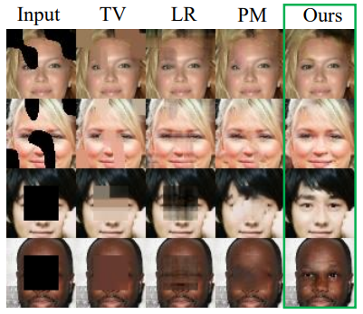
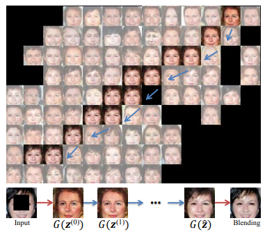
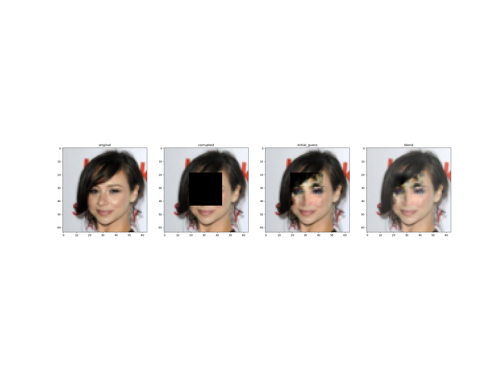
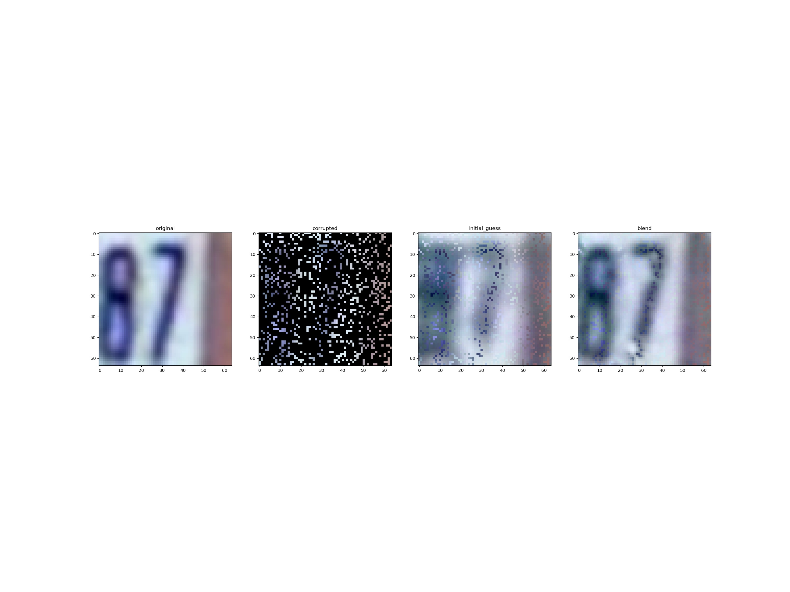

# Semantic-Image-Inpainting-with-Deep-Generative-Models
This repository recreates the methodology in the Semantic-Image-Inpainting-with-Deep-Generative-Models paper. 
https://arxiv.org/pdf/1607.07539.pdf. The goal of the paper is to do image inpainting using GANs. To do so the authors
suggest to first train a GAN model and secondly find the input noise vector of the GAN model that would give the closest 
image to the corrupted one. 

### Datasets

Datasets need to be in a 'Datasets' folder.
- CelebA can be downloaded from https://www.kaggle.com/datasets/jessicali9530/celeba-dataset
- SVHN dataset can be obtained with torchvision.datasets 

### How to use the project

1) Run training_dcgan.py or training_wgan.py to get a trained ***GAN*** model. 
2) Run z_optimization.py to produce blended images with the trained ***GAN***. 
3) Run metric.py to compute the PNSR for the different masks. 

### Results

