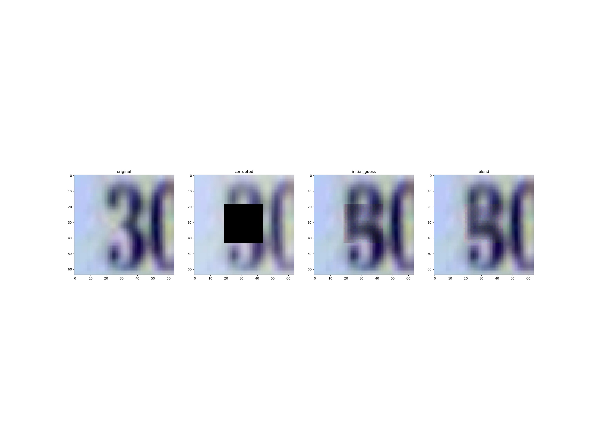

# Semantic-Image-Inpainting-with-Deep-Generative-Models
This repo reproduce the methodology in the Semantic-Image-Inpainting-with-Deep-Generative-Models paper. 
https://arxiv.org/pdf/1607.07539.pdf

- CelebA images need to be in a folder in the 'Datasets' folder.
- SVHN dataset can be obtained with torchvision.datasets 
 
To run the project, do:
1) Run training_dcgan.py with the hyperparameters to get a trained generator and discriminator. 
2) Run z_optimization.py to produce blended images with the trained **DCGAN**. 
3) Run metric.py to compute the PNSR for the different masks. 

To compare with a WGAN with gradient penalty
1) Run the training_wgan.py to get a generator.
2) Run z_optimization.py to produce blended images with the trained **WGAN** generator. 
3) Run metric.py to compute the PNSR for the different masks with the right hyperparameters. 

